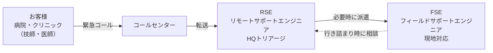
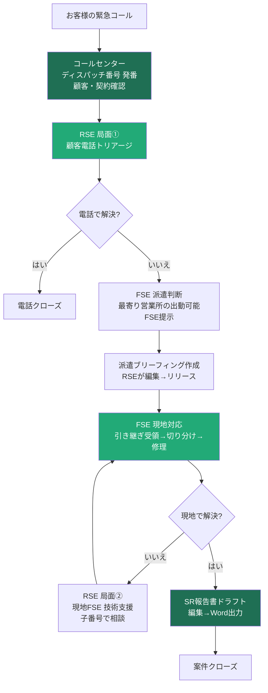
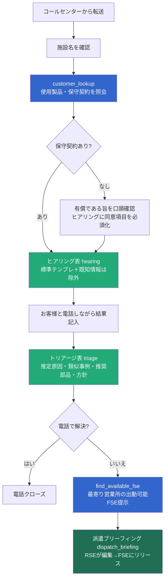
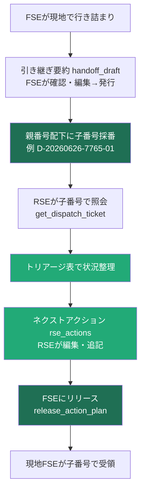
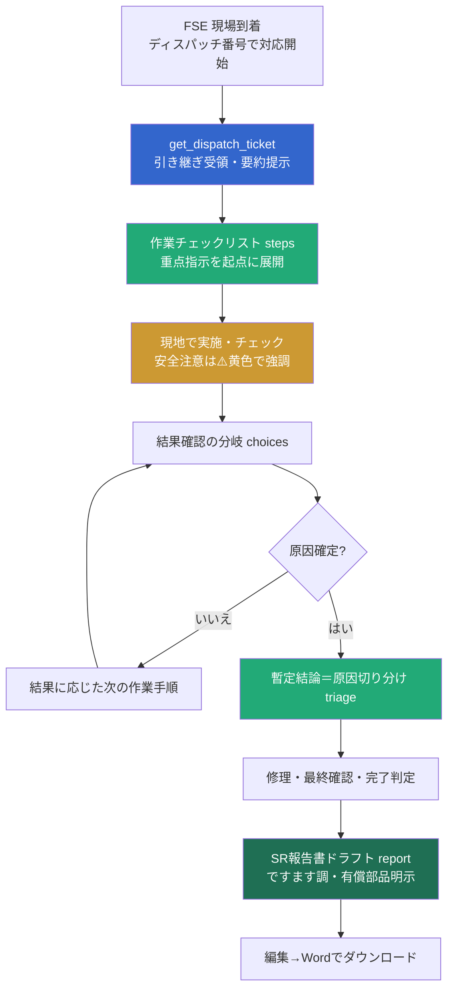
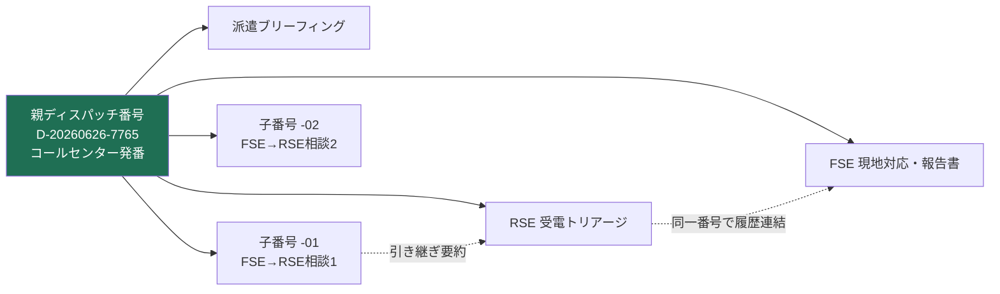
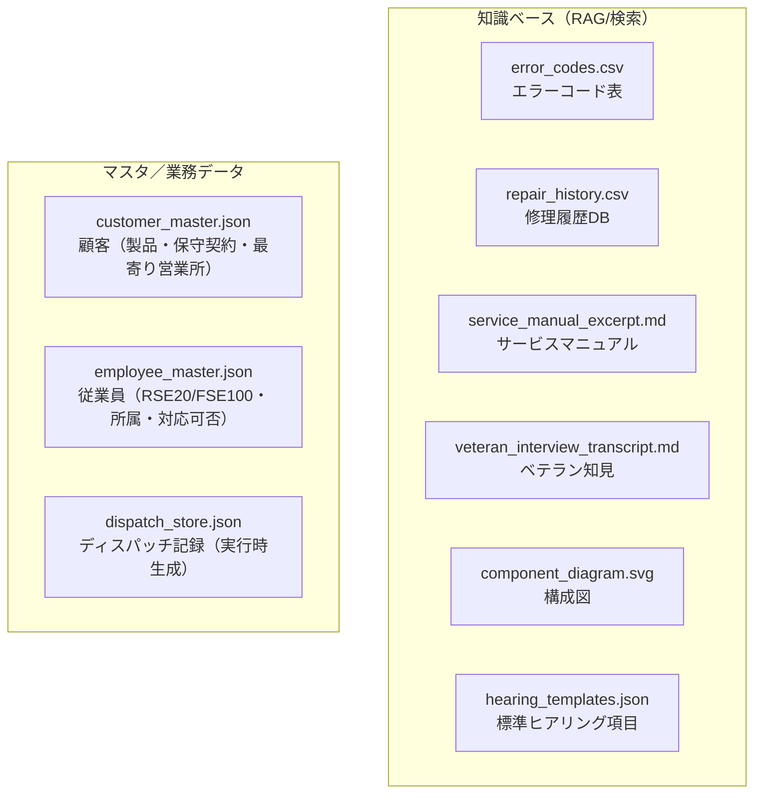
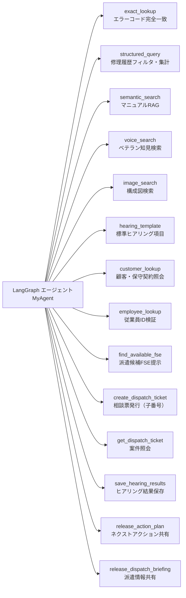

# 医療機器アフターメンテナンス支援エージェント — 設計レビュー資料

> 対象：ピアレビュー  
> 対象機種（合成データ）：内視鏡システム「EVS-X1000」（架空）  
> ベース：DataRobot Agentic Starter Application Template（フレームワーク：LangGraph）  
> リポジトリ：github.com/SIJICHI/After-Maintenance-Support-Agent

---

## 1. このアプリは何か（目的）

医療機器のアフターメンテナンス業務において、**現場のフィールドサポートエンジニア（FSE）** と
**HQのリモートサポートエンジニア（RSE）** の判断・作業・引き継ぎを、Agentic RAG（マルチツール）で
支援するモックアップである。狙いは次の2点。

1. **技能継承・現場支援**：ベテランの暗黙知やマニュアル・修理履歴を横断検索し、根拠付きで提示する。
2. **業務プロセスの一気通貫支援**：コールセンター受電 → RSEトリアージ → FSE派遣 → 現地対応 →
   報告書まで、1つのディスパッチ番号で串刺しして支援する。

### 基本設計思想（最重要）

| # | 原則 | 内容 |
|---|---|---|
| 0 | **安全表示は不可侵** | 患者・ユーザー・作業員の安全に直結する注意事項（`!`）は⚠️黄色で必ず強調。削除・無効化しない。回帰テストで保護。 |
| 1 | **出力はドラフト、確定は人間** | エージェント生成物は叩き台。FSE/RSEが編集・追記・削除して最終確定する（human-in-the-loop）。 |
| 2 | **全成果物が編集可能（同一UX）** | ヒアリング・トリアージ・作業手順・引き継ぎ・ブリーフィング・報告書を画面上で編集可能。 |
| 3 | **ペルソナは従業員IDで判別** | RSE####/FSE#### を従業員マスタ照合で検証してペルソナ確定。 |
| 4 | **運用ルールは差し替え可能に分離** | ディスパッチ発番ルール等はメーカー差異を `dispatch_policy.py` に集約。 |

---

## 2. 対象ペルソナ

- **RSE**：受電トリアージ（電話クローズ or 派遣判断）、現地FSEの技術支援。最も知識・経験のあるシニア。
- **FSE**：現地で診断・修理。必要に応じてRSEに相談（エスカレーション）。

---

## 3. 全体業務ライフサイクル

コールセンターが発番した**1つのディスパッチ番号**の配下に、RSE・FSEの全活動が紐づく。

---

## 4. RSE 局面①：顧客電話トリアージ

受電したRSEが「電話でクローズできるか／FSEを派遣するか」を判断する。保守契約の有無で**有償/無償**が分岐。

ポイント：
- ヒアリング項目はエラーコード（カテゴリ）別の**標準テンプレート**で一貫化。既知情報（申告済みコード等）は再確認しない。
- ヒアリングは**状態・事実の確認**に限定（お客様に部品交換等の作業を依頼しない）。
- 結論は固定フォーマットの**トリアージ表**に集約（全項目RSEが編集可能）。

---

## 5. RSE 局面②：現地FSEの技術支援（バックアップ）

既に派遣されたFSEが行き詰まって相談する局面。**親ディスパッチ番号の配下に子番号**（例 D-…-01）を採番。

※ 局面②では「使用中止・患者安全確保」等の顧客向け初動指示は出さない（受電時に対応済み）。
読み手はRSE／現地FSEであり、技術支援に徹する。

---

## 6. FSE 現地フロー

派遣で現場入りしたFSEは、RSEの引き継ぎ（ブリーフィング）を**出発点**として現地切り分けに合流する
（症状の再入力は不要）。

ポイント：
- 作業手順を出すメッセージには必ず**結果確認の分岐**を伴わせ、現地の状況に応じて手順が進む。
- 選択肢に無い観察は「**その他（自由記述）**」で受け、診断を見直す。
- 完了時のSR報告書は**顧客提出版**（ですます調・有償部品の有無を明示・社内根拠は載せない）。

---

## 7. ディスパッチ番号による串刺し（1案件＝1番号）

複数の担当者・チャットを横断して、1つの案件をディスパッチ番号で連結する。

- ヒアリング結果・トリアージ・ブリーフィング・作業履歴・報告書はすべて番号配下に保存（後日トラック可）。
- 交代要員も「自分のIDで新チャット＋同じ番号」で過去経緯を引き継げる。

---

## 8. データ／マスタ構成（合成データ）

---

## 9. エージェント構成とツール

LangGraph の単一エージェントが、以下のツール群（LangChain `@tool`）を状況に応じて呼び出す。

| 区分 | ツール |
|---|---|
| 知識検索 | exact_lookup / structured_query / semantic_search / voice_search / image_search / hearing_template |
| マスタ照会 | customer_lookup / employee_lookup / find_available_fse |
| 案件・引き継ぎ | create_dispatch_ticket / get_dispatch_ticket / save_hearing_results / release_action_plan / release_dispatch_briefing |

---

## 10. UI上の主要コンポーネント

エージェントは特殊マーカーを出力し、フロントが対応するインタラクティブUIに描画する。

| マーカー | UI | 役割 |
|---|---|---|
| `[[choices]]` | 水色の選択肢ボタン（＋その他） | 分岐質問への回答 |
| `[[hearing]]` | チェック付き表（メモ編集・行追加） | 顧客ヒアリング |
| `[[steps]]` | チェック付き作業表（⚠️安全強調） | 現地作業手順 |
| `[[triage]]` | 編集可能な表 | 推定原因・類似傾向 |
| `[[handoff_draft]]` | 編集フォーム＋発行 | FSE→RSE引き継ぎ要約 |
| `[[rse_actions]]` | 編集表＋リリース | RSE→FSEネクストアクション |
| `[[dispatch_briefing]]` | 編集フォーム＋リリース | HQ→営業所 派遣ブリーフィング |
| `[[report]]` | 編集／プレビュー＋Word出力 | SR報告書ドラフト |
| `[[sources]]` | 箇条書き＋モーダル（図面表示可） | 参照情報源 |
| `[[complete_action]]` | 全完了時の確認 | 報告書ドラフト要否 |

- 画面左には**プロセスマップ**を表示し、各ステップカードのクリックで該当箇所へジャンプ。
- アクションボタンは緑＋黒文字、分岐選択肢は水色＋黒文字で統一。

---

## 11. 技術スタック

- **ベース**：DataRobot Agentic Starter Application Template
- **エージェント**：LangGraph（`datarobot_agent_class_from_langgraph` + `get_llm()`、`@tool`）
- **バックエンド**：FastAPI（AG-UI ストリーミング）
- **フロントエンド**：React / Vite（チャットUI＋カスタムUIコンポーネント）
- **LLM**：DataRobot LLM Gateway 経由

---

## 12. モックの制約・将来拡張

**モックの割り切り（本実装では未対応）**
- 認証・アクセス制御・マルチテナント。
- 部品在庫システム連携。院内ネットワーク制約対応。
- 専用のASR（音声認識）・CV（画像認識）モデル。

**将来拡張ポイント**
- 参照情報源モーダルの図面に加え、動画・PDF・文書管理システム（DMS）連携。
- 「その他（自由記述）」での音声・画像・動画入力（マルチモーダル）。
- ディスパッチ発番・担当アサイン・引き継ぎルールのメーカー別設定化。
- 顧客マスタ／従業員マスタの認証基盤・基幹システム連携。

---

## 13. ピアレビューでの確認観点（提案）

1. **業務フローの妥当性**：RSE局面①/②、FSE現地、エスカレーション、有償/無償判断は実運用と整合するか。
2. **安全設計**：安全注意（⚠️）の強調・不可侵化は十分か。患者・作業員安全の観点で漏れはないか。
3. **human-in-the-loop**：全成果物の編集可能化と「確定は人間」の徹底は適切か。
4. **ペルソナ／権限**：従業員ID検証・ペルソナ分岐・読み手の取り違え防止は妥当か。
5. **データ／引き継ぎ**：ディスパッチ番号による串刺し・履歴保存・交代要員の引き継ぎは実用的か。
6. **拡張性**：発番ポリシー分離・マスタ連携の差し替え可能性は将来要件に耐えるか。
